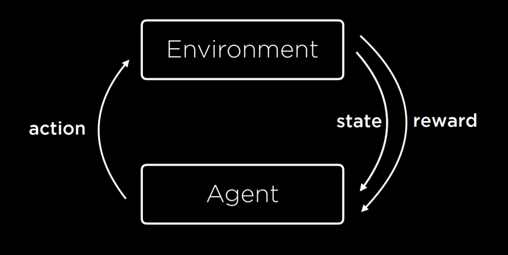
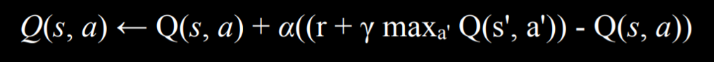

# Learning
# Machine Learning
    机器学习
# Supervised Learning
    supervised Learning is the process of learning with traning label
    label 即表明了数据的一些特性
    总的来说 supervised learning 是在知道正确答案的情况下对AI的一种训练过程
    比如 判断给出的图片中的水果是苹果还是梨子 不断给AI提供图片进行判断 AI初始时会进行随机判断然后 然后每次将判断结果和实际结果进行比对
    然后一些方法不断提高准确性 
classification 就是其中一种 将输入的数据进行分类 
会有一个函数f将输入值 将输入值映射为一个离散值(例如 下雨或不下雨) 我们的要做的就是实现一个函数 可用于测试这个函数f的准确性

## Nearest-Neighbor Classification
    简而言之 就是 对于输入后离散化的数据 根据其在坐标系中最近的点的值 来决定它的值
    (比如说 这个输入 离散化后 在坐标系中距离最近的一个点 为下雨 那么这个点就是下雨)
k-nearest-neighbors classification 作为Nearest-Neighbor Classification的升级版
主要是解决了 Nearest-Neighbor Classification 的缺陷  当一个点最近的是A 但是其他10稍微远一些的点为B 此时按照Nearest-Neighbor Classification 
则会将这个点归为A 但其实是应该是B 更准确些 当然这个方法的关键在于确定k的值、
## Perceptron Learning  
同样的事物 不同的人感知可能是不同的 Perceptron 中文就是感知器的意思 不同对不同事物的感知不同
Perceptron Learning 是着眼于全局的数据  去确立决策的原则
基本思想如下
input {x1 , x2 , x3}
weights {w1 , w2 , w3}
为输入的数据 赋权 
然后设置一个 bias 或者说是 threshold (就是一个函数 用于判断结果)
将所有输入值 与其权值相乘 然后根据给定的函数即可判断出结果
1. hard threshold 的情况下 (和间断函数差不多) 那么所得值就只能是 0 或 1
2. soft threshold 的情况下 (正常单调不减函数 从 0 - 1) 就可以获取 0 1 中间值 判断这个值是更接近0 还是 1

## Support Vector Machines 
    用一组额外的向量组 去确定数据分类时的边界   因为二维空间中 两团不同的数据之间的分界线可以有无数条 但其中是有最优解的
    Maximum Margin Separator : 这种分界方法会与每组数据都保持最大距离 从而新加入变量进行判断时 可以有最为公平的结果

# Regression
    根据现有数据 根据一个h 去尝试估计现有行为f 生成一条线 依据现有的输入预测其输出
## Loss function
    Regression 最重要其实就是 h 即 hypothesis function 因为整条线就是依据这个h生成的
    所以评估h 的性能就非常重要 也就是用到 loss function 去进行评估
loss function 有很多种 比如说 将预测值 与实际值相比较 如果错误 则加入 function 
0-1 Loss Function
可以用于classification 问题中 
```
L(actual, predicted):
    0 if actual = predicted
    1 otherwise
```
总的来说 L 只能返回两个值 true false 即预测值是否正确 适用于一些 只有两种情况(离散)的问题 比如说 今天是否下雨 那么只有结论只有 是与不是
但有时要解决一些连续变量的问题 比如说 实际收益为1000 而预计可能为2000 5000 虽然2000 5000都不是结果 但显然2000 要更符合要求一些 这两个值显然是不同的
```
L₁: L(actual, predicted) = |actual - predicted|
L₂: L(actual, predicted) = (actual - predicted)²
```
L1 返回差值的绝对值 
L2 返回差值的绝对值的平方 相当于将放大了偏差值

## Overfitting
    过度拟合
生成的曲线过度贴合数据 表现loss function很小甚至为0 但是这样的所生成曲线在面对新数据时可能会出现差错

## Regularization
    用于避免overfitting
    在对数据一些进行预测的时候 上述的几种ML(regression/ K-nearest neighbors /support vector Machine)方法都是可以使用 
    但是不同算法 实际运用的时候性能是不一样的 所以需要一些方法取判断这些算法的性能 也就是下面的这些概念
cost(h) = loss(h) + λcomplexity(h)  (这里 官方给出的 h 是 hypothesis 其实就把它理解成一个函数好了)
λ 为一个常量 λ 越大则 complexity(h) 对最终结果的影响越大
### Holdout Cross Validation
将数据分为 两部分 training set  test set 
在training set中运行 算法 然后将其预测值 与 test set 的数据比较
### k-Fold Cross-Validation
总的来说 Cross Validation 的核心就是将数据 分块 一部分用于train 另一部分用于test
当然这就会有很多分法 也就会影响到时间和效率
以 k = 4 为例 那么 k-Fold Cross-Validation 就是
将数据分为 4 块 
第1轮: 1 2 3 train 4 test
第2轮: 1 2 4 train 3 test
第3轮: 1 3 4 train 2 test
.....
然后最后根据不同算法 测试后 预测数据的 正确 和 错误数量 决定使用哪种算法

## Reinforcement Learning
    Supervised Learning 主要依赖于所输入的数据进行学习 Reinforcement 是通过是一种反馈机制 对于agent 的行为进行反馈(比如 +1 -1)

Environment 为 agent 提供一个初始状态 然后agent 执行一个action(可以理解为操作) 其实就是状态转移 
然后 environment 根据这个action 返回一个新的 state 以及 reward (正反馈 那么这个action 以后出现的可能性就越大 负反馈则反之)
整个有点状态机的感觉

## Markov Decision Processes
Reinforcement Learning 可以看作是一种 Markov decision process
有以下基本属性:
- Set of states S
- Set of actions Actions(S)
- Transition model P(s’ | s, a)
- Reward function R(s, a, s’)
比如在寻路问题中 如果agent 走到障碍物 则返回 负反馈 这样多次后 agent 就会学会什么状态下可能会遇到障碍物 从而可以学会避开障碍物

## Q-Learning
    Model-free learning is when an AI can directly derive an optimal policy from its
    iteractions with the environment without needing to create a model beforehadd
    Q learning is a model-free technique that can be used to find the optimal action-selection 
    policy using a Q function
    Q Learning 是一种  AI 可以直接从与环境的交互中获得结果 而无需事先建立模型 使用Q function 去获取最优解

- Q(s,a) : 输出 在state s 中进行 action a 后的估计值
当action 进行 以及收到 reward后
  1. 在当前的reward 和 未来 reward 的基础上估计 Q(s,a) 就是计算其结果
  2. 基于旧的 Q(s,a) 估计值 以及 新的估计值的基础上 更新 Q(s,a)
Q(s, a) ⟵ Q(s, a) + α(new value estimate - Q(s, a))
对于 Q(s,a) 的更新 等价于 原Q(s,a) 基础上加上 α * (新旧Q(s,a)估计值之间的区别)  
- 当 α = 1 时相当于 新的Q(s,a) 直接取代了原Q(s,a)
- 当 α = 0 时 Q(s,a) 永远不会被更新
新的Q(s,a)的估计值 又被视作 reward(r)与 新的估计值的累加和 新的状态必定会受上到上一次action操作的影响 所以在这个过程不断将可以带来 high reward
的 action 加入状态 所以这样的话 我们对action 性能的估计就不仅仅局限于当前所得到reward 还要考虑当前这步会在未来所带来的reward
因此就可得到下列公式
 

### Explore vs. Exploit
    The exploration vs exploitation dilemma is exemplified by the question of whether 
    an AI should trust the learnt values of Q enough to select actions based on it or try other
    actions hoping that might better reward
这个问题的场景大概是这样
有A B 两个点位  agent 访问A则可以固定获得 +1  而访问有 90%的概率-1 却有10%的概率+100
所以这样就会产生问题 因为如果前几次访问 agent 均是从A 中+1 而从B 中-1 
那么根据此前的公式 agent就会越来越倾向于每次都走相同的路线访问A 并且永远无法获得那个更好的结果 其最后的结果也会产生误差

1. 为解决上述问题 最直接的思路 就是 有的时候要不依赖公式 而随机做出选择 则仍有可能获得更优解
即 ε (epsilon) greedy 其中ε 表示随机移动的可能性
2. 另一种思路就是并非每次移动都直接给出反馈 而是根据最终的结果给出反馈 (比如 摆盘子的游戏 因为这游戏也只有最终结果的反馈性才比较明显 只有当分出胜负再返回reward)

