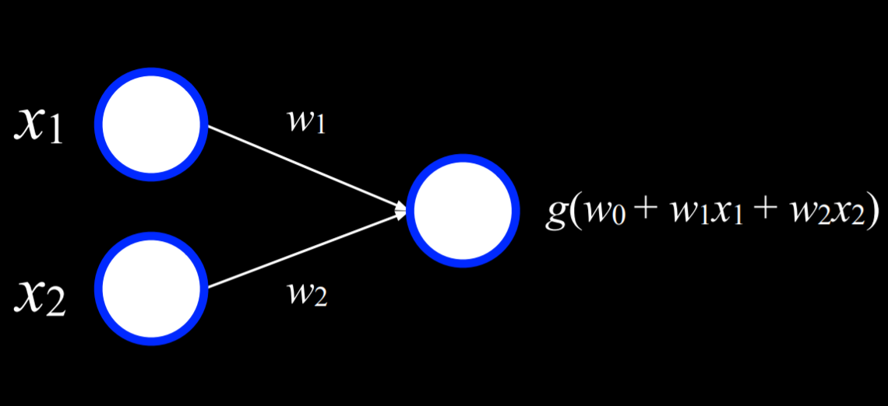

# Neural Networks
## Activation Function
激活函数 
为神经元加入非线性元素 否则每一层的输出 都只能上一层 输入的线性组合 这使得最终输出也只能是一系列线性组合
加入activation function 可以使得神经网络逼近任意非线性函数
常用 activation function :
1. step function : 就是将输出分为两个值 >0 输出 1 否则为0
2. logistic sigmoid: 输出是介于 0 1之间的数值 
3. Rectified Linear Unit(Relu): 输出任何正值 负值为0

## Neural Network Structure
可以根据上述 activation function 的思路继续向下推导
多个输入 通过一个函数 映射到输出 就是一个基本的神经网络

左边的节点为输入 右边为输出 两者的关系通过函数进行映射
在本例中 x1 x2 分别有其对应的 weight 最终的结果是经过加权运算后 再根据函数g() 运算后而得出的 

## Gradient Descent
梯度下降法 用来优化损失函数
在上述例子中 该网络训练数据 所最终输出的值 主要就是根据对 x1 x2 设置的权值
对于上述例子中 如果想要使用 Gradient Descent 可以有如下思路:
1. 随机选择一个权值 (因为最终输出值是由权值影响 所以权值的选择就决定了最终的误差) 
2. 重复以下步骤:
    1. 根据所有输入数据的结果的损失值 计算梯度
    2. 最终会生成一个梯度向量
    3. 根据这个梯度 更新权值
上述方法的梯度计算 是基于所有数据的 这就导致了计算成本(cost) 过大的问题
可以通过 Stochastic Gradient Descent 等方法来减少 这一cost 
**Stochastic Gradient Descent:** 随机梯度下降 核心优化思想就是用样本中的一个例子 来近似所有样本 存在问题的就是每次计算得到的并不是一个准确的梯度
即并不是每次对于损失函数优化的都是朝着最优解的方向 但只要这个随机是足够随机的 总体来说整个优化趋势肯定是朝着全局最优解的方向
**Mini-Batch Gradient Descent:** 上面的随机梯度下降是只选取一个 Mini-Batch 要稍微折中一些每次计算时选取一些小样本来近似全部

## Multilayer Neural Networks
上面的那个神经网络为单层的神经网络 所分析的出的数据也是基于一个线性的函数 所以最终所得到也是一个线性的决策边界 但现实世界中的数据分布显然不可能是线性的
这就需要多层神经网络 即 Multilayer Neural Networks
在input layer 和 output layer 中间的都是 hidden layer , 我们只向input layer 中输入数据 , 所有 hidden layer 仅从其上层中获取数据 
然后再通过计算将数据传向下一层 hidden layer 重复上述过程最终会训练出非线性的结果

## Backpropagation
反向传播
Gradient Descent 是用于优化loss function 对于单层的神经网络参数比较简 但对于中间的hidden layer的计算就会比较困难 
而Backpropagation 就是用来解决这一问题的
核心思想如下:
1. 计算输出层的误差
2. 对于每一层 从输出层开始往隐藏移动:
    1. 将当前层的错误传递给前一层
    2. 更新权值、
这个可以应用到任何层数的神经网络 即深度学习网络

## Overfitting
将数据模型训练的过于紧密而导致无法发现新数据则称为overfitting(过度拟合)
方法就是dropout:
我们临时性的随机删除一个节点 通过这种方法可以解决神经网络中的节点依赖过于紧密的问题
在训练过程中神经网络会发现这其中的不同 每次都会删除一些其他节点 然乎再次使用它们

## TensorFlow
    用于深度学习的库 目前有点被PyTorch比下去了 而且我感觉PyTorch的使用范围更广一些
    所以这一节我也就没有做CS50x的项目 找了个PyTorch的教程跟着学了一遍然后完成项目

